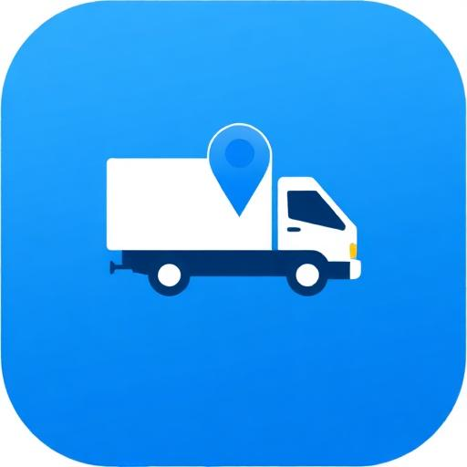

<p align="center">
  
</p>

<h1 align="center">FleetTrack FMS</h1>

<p align="center">
  <strong>Enterprise Fleet Management System</strong><br/>
  Real-time GPS tracking · Fuel intelligence · Driver safety · Predictive maintenance
</p>

<p align="center">
  <a href="https://fleet.goffice.et">Live Demo</a> ·
  <a href="#features">Features</a> ·
  <a href="#architecture">Architecture</a> ·
  <a href="#getting-started">Getting Started</a>
</p>

---

## Overview

FleetTrack FMS is a comprehensive, enterprise-grade fleet management platform designed for logistics companies, transport operators, and organizations managing vehicle fleets of any size. It provides real-time visibility into fleet operations, automates compliance workflows, and delivers actionable insights to reduce operational costs by 10–25%.

Built with a modern React stack and powered by Supabase for real-time data, authentication, and edge functions, FleetTrack is deployable as a Progressive Web App (PWA) with full offline capability.

---

## Features

### 🗺️ Real-Time Tracking & Maps
- **Live GPS Tracking** — Sub-minute position updates with clustered map visualization (Mapbox GL / MapLibre)
- **Geofencing** — Draw custom zones with entry/exit alerts and dwell-time monitoring
- **Route History & Replay** — Time-warp playback with speed corridor overlays
- **Heatmap & Anomaly Detection** — Visual density maps and GPS jamming indicators
- **Convoy Mode** — Group tracking for fleet convoys
- **Street View Integration** — Instant ground-level context for any vehicle position
- **Nearby Vehicle Search & Proximity Radar** — Find the closest asset to any point
- **Smart Dispatch Suggestions** — AI-powered vehicle-to-job matching based on proximity and availability

### ⛽ Fuel Management
- **Fuel Transaction Logging** — Per-vehicle fill-up records with duplicate detection
- **Fuel Anomaly Detection** — AI-driven identification of theft, siphoning, and unusual consumption
- **Approved Fuel Station Network** — Geofence-linked station management
- **Fuel Request & Clearance Workflow** — Structured approval process with liters-based dispensing control
- **Fuel Card & Mobile Money Integration** — OLA, TotalEnergies, NOC provider dashboards
- **Fuel Depot Management** — Capacity tracking and inventory for bulk fuel storage
- **Idle Time Impact Analysis** — Cost quantification of excessive idling

### 🚗 Vehicle Management
- **Fleet Dashboard** — KPI scorecards with real-time fleet health overview
- **Vehicle Inspections** — Digital pre-trip and post-trip checklists with photo capture
- **Maintenance Scheduling** — Calendar/mileage-based preventive maintenance with auto-generated work orders
- **Predictive Maintenance** — AI-powered failure prediction and component lifecycle analysis
- **Tire Management** — Tread depth tracking, rotation scheduling, and cost-per-km analysis
- **EV Management** — State-of-charge monitoring, charging sessions, and station availability
- **Vehicle Requests & Pool Management** — Approval-based vehicle assignment workflow
- **Rental & Outsource Tracking** — Third-party contract management with cost projections
- **Parts Inventory** — Stock levels, reorder alerts, and usage-linked consumption

### 👨‍✈️ Driver Management
- **Driver Profiles & HR** — Comprehensive profiles with license tracking, certifications, and document management
- **Driver Behavior Scoring** — Composite safety scores from speeding, braking, acceleration, and idle metrics
- **AI-Powered Insights** — Per-driver coaching recommendations and risk factor analysis
- **Gamification & Achievements** — XP rewards, badges, and leaderboards to incentivize safe driving
- **Driver Availability & Scheduling** — Shift management and real-time availability status
- **Logbook & HOS Compliance** — Digital hours-of-service tracking
- **Training Management** — Course tracking and certification renewal reminders
- **Alcohol & Fatigue Testing** — Test result logging with pass/fail tracking and action documentation
- **Penalty & Fine Tracking** — Traffic violation records linked to drivers and vehicles

### 📊 Analytics & Reporting
- **Dashboard Builder** — Drag-and-drop custom dashboards with configurable KPI widgets
- **Performance Simulation** — What-if scenario modeling for fleet optimization
- **KPI Scorecard** — Organization-wide performance metrics with trend analysis
- **ADAS Reports** — Advanced driver-assistance system event reporting
- **Carbon Emissions Tracking** — CO₂ calculations with offset credit management
- **Bulk Export** — CSV, PDF, and scheduled email report delivery
- **Custom Report Builder** — Configurable report templates with date range filtering

### 🔔 Alerts & Notifications
- **Configurable Alert Rules** — Multi-condition triggers with severity levels
- **Multi-Channel Delivery** — Push notifications, SMS (Ethio Telecom/Twilio/Africa's Talking), WhatsApp, and email
- **Device Offline Monitoring** — Automatic alerts when trackers go silent
- **Speed Violation Reports** — Automated over-speed event reporting with configurable thresholds

### 🔧 Device & Hardware Integration
- **Multi-Protocol GPS Support** — Coban, YTWL, and custom protocol decoders
- **Device Command Queue** — Remote engine cut/restore, speed limiting, interval configuration, and firmware updates
- **Speed Governor Control** — Remote speed limit enforcement via SMS commands
- **RFID Pairing** — Driver-to-vehicle authentication via RFID tags
- **Dash Cam Events** — AI-labeled video event review with severity classification
- **Hardware Sensor Monitoring** — Temperature, humidity, voltage, and fuel-level sensor integration
- **Cold Chain Monitoring** — Continuous temperature/humidity tracking with threshold alarms
- **Device Health Dashboard** — Heartbeat monitoring, firmware status, and connectivity analytics

### 🏢 Organization & Administration
- **Multi-Tenant Architecture** — Full organization isolation with cross-tenant super admin capabilities
- **Role-Based Access Control (RBAC)** — 8-tier role hierarchy: Super Admin, Org Admin, Fleet Manager, Operator, Driver, Viewer, Mechanic, Technician
- **Delegation Matrix** — Configurable approval authority with time-bound substitutions
- **Business Units & Depots** — Hierarchical organizational structure
- **Contract Management** — Vendor contracts with auto-renewal tracking
- **Compliance Calendar** — Deadline tracking with configurable reminders
- **Vendor Management** — Supplier directory with service history
- **Document Management** — Centralized document storage with verification workflows

### 🔒 Security
- **Hardened Authentication** — Email whitelist, account lockout (3 attempts/15 min), progressive backoff
- **Row-Level Security (RLS)** — 350+ policies ensuring complete data isolation per tenant
- **Rate Limiting** — Per-user, per-table, and per-IP rate limiting at both database and edge function layers
- **Audit Logging** — Immutable, append-only audit trail for all security events
- **API Key Management** — Scoped API keys with IP whitelisting and expiration
- **Impersonation Auditing** — Full activity logging for super admin cross-tenant operations
- **Content Security Policy** — Strict CSP headers preventing XSS and data exfiltration
- **GDPR Compliance** — Data subject request management and retention policy enforcement

### 🤖 AI & Intelligence
- **AI Fleet Assistant** — Natural language chat interface powered by multiple LLMs (GPT-5, Gemini)
- **Anomaly Detection** — Automated identification of unusual patterns in fuel, routes, and driver behavior
- **Fleet Insights** — AI-generated operational recommendations
- **Predictive ETA** — Machine learning-based arrival time estimation
- **Driver Score Calculation** — Automated composite scoring from telemetry data

### 🌍 Internationalization
- **Multi-Language Support** — i18n framework with browser language auto-detection
- **Multi-Currency** — Configurable currency display per organization
- **Timezone Handling** — Per-device timezone configuration

### 📱 Progressive Web App
- **Installable PWA** — Add-to-home-screen with native app experience
- **Responsive Design** — Optimized for desktop, tablet, and mobile viewports
- **Mobile Navigation** — Bottom navigation bar with swipe gestures
- **Offline Capable** — Service worker for core functionality without connectivity

---

## Architecture

```
┌─────────────────────────────────────────────────────────┐
│                     Client (PWA)                        │
│  React 18 · TypeScript · Tailwind CSS · shadcn/ui       │
│  Mapbox GL / MapLibre · Recharts · React Query          │
├─────────────────────────────────────────────────────────┤
│                   Supabase Platform                     │
│  ┌──────────┐  ┌──────────┐  ┌────────────────────┐    │
│  │ Auth     │  │ Realtime │  │ Edge Functions (23) │    │
│  │ (RLS)    │  │ (WS)     │  │ GPS · AI · SMS     │    │
│  └──────────┘  └──────────┘  └────────────────────┘    │
│  ┌─────────────────────────────────────────────────┐    │
│  │            PostgreSQL Database                  │    │
│  │  60+ tables · 350+ RLS policies · Triggers      │    │
│  └─────────────────────────────────────────────────┘    │
├─────────────────────────────────────────────────────────┤
│                  External Services                      │
│  Mapbox · LeMat Geocoding · ERPNext · SMS Gateways     │
└─────────────────────────────────────────────────────────┘
```

### Tech Stack

| Layer | Technology |
|-------|-----------|
| **Frontend** | React 18, TypeScript 5, Vite 5 |
| **Styling** | Tailwind CSS 3, shadcn/ui, Framer Motion |
| **State** | TanStack React Query, React Context |
| **Maps** | Mapbox GL JS, MapLibre GL, Supercluster |
| **Charts** | Recharts |
| **Backend** | Supabase (PostgreSQL, Auth, Realtime, Edge Functions) |
| **AI** | Lovable AI Gateway (GPT-5, Gemini 2.5/3) |
| **PDF** | jsPDF, html2canvas |
| **Forms** | React Hook Form, Zod validation |
| **i18n** | i18next |
| **PWA** | vite-plugin-pwa |

### Edge Functions

| Function | Purpose |
|----------|---------|
| `gps-data-receiver` | Ingests telemetry from GPS devices |
| `gps-external-api` | External API for third-party GPS integrations |
| `ai-chat` | AI-powered fleet assistant |
| `ai-fleet-insights` | Automated fleet optimization recommendations |
| `ai-anomaly-detector` | Anomaly detection in fuel and route data |
| `calculate-driver-scores` | Composite driver behavior scoring |
| `create-user` | Secure user provisioning with role assignment |
| `send-sms` | SMS delivery via configured gateways |
| `send-whatsapp` | WhatsApp message delivery |
| `send-push-notification` | Web push notifications |
| `send-speed-violation-report` | Automated speed violation alerting |
| `send-governor-command` | Remote speed governor control |
| `process-device-commands` | Device command queue processing |
| `process-geofence-events` | Geofence entry/exit event processing |
| `process-driver-penalties` | Automated penalty calculation |
| `monitor-device-connectivity` | Device offline detection |
| `get-mapbox-token` | Secure Mapbox token distribution |
| `get-lemat-token` | LeMat geocoding authentication |
| `lemat-reverse-geocode` | Address lookup from coordinates |
| `erpnext-sync` | ERPNext ERP integration |
| `log-impersonation` | Super admin impersonation audit |
| `log-impersonation-activity` | Impersonation activity tracking |

---

## Getting Started

### Prerequisites

- **Node.js** ≥ 18
- **npm**, **bun**, or **pnpm**
- A [Supabase](https://supabase.com) project (or Lovable Cloud)

### Installation

```bash
# Clone the repository
git clone <YOUR_GIT_URL>
cd fleettrack-fms

# Install dependencies
npm install

# Start the development server
npm run dev
```

### Environment Variables

| Variable | Description |
|----------|-------------|
| `VITE_SUPABASE_URL` | Supabase project URL |
| `VITE_SUPABASE_PUBLISHABLE_KEY` | Supabase anon/public key |
| `VITE_SUPABASE_PROJECT_ID` | Supabase project reference ID |

### Edge Function Secrets

| Secret | Purpose |
|--------|---------|
| `SUPABASE_SERVICE_ROLE_KEY` | Admin operations |
| `LOVABLE_API_KEY` | AI Gateway access |
| `VITE_MAPBOX_TOKEN` | Map rendering |
| `MAPBOX_PUBLIC_TOKEN` | Client-side maps |
| `LEMAT_API_KEY` | Reverse geocoding |
| `GATEWAY_SHARED_KEY` | TCP gateway authentication |

---

## Database Schema

The system uses **60+ PostgreSQL tables** organized across these domains:

- **Core** — `organizations`, `profiles`, `user_roles`, `permissions`, `role_permissions`
- **Fleet** — `vehicles`, `drivers`, `devices`, `device_commands`, `device_protocols`
- **Telemetry** — `vehicle_telemetry`, `vehicle_telemetry_history`, `cold_chain_readings`
- **Trips** — `trips`, `route_history`, `dispatch_jobs`, `dispatch_pod`
- **Fuel** — `fuel_transactions`, `fuel_depots`, `approved_fuel_stations`, `fuel_cards`
- **Maintenance** — `maintenance_schedules`, `work_orders`, `service_history`, `parts_inventory`
- **Safety** — `driver_behavior_scores`, `alerts`, `incidents`, `dash_cam_events`
- **Compliance** — `documents`, `vehicle_insurance`, `compliance_calendar`, `contracts`
- **Analytics** — `carbon_emissions`, `driver_ai_insights`, `driver_achievements`
- **Security** — `audit_logs`, `account_lockouts`, `api_keys`, `security_events`

All tables enforce **Row-Level Security (RLS)** with organization-scoped policies targeting the `authenticated` role.

---

## Security Model

FleetTrack implements a **7-layer security architecture**:

1. **Edge Function Hardening** — CORS validation, JWT verification, input sanitization, rate limiting
2. **Security Headers** — CSP, HSTS, X-Frame-Options, X-Content-Type-Options
3. **Authentication** — Email whitelist, progressive lockout, anti-enumeration
4. **RBAC** — 8-tier role hierarchy with granular permissions
5. **Row-Level Security** — 350+ RLS policies with `SECURITY DEFINER` helper functions
6. **Database Triggers** — Rate-limiting triggers, payload validation, deduplication checks
7. **Audit Trail** — Immutable append-only audit logs with full event capture

---

## Role Hierarchy

| Role | Scope | Capabilities |
|------|-------|-------------|
| `super_admin` | Platform-wide | Full access, cross-tenant operations, user provisioning |
| `org_admin` | Organization | Organization settings, user management, all operational data |
| `fleet_manager` | Organization | Vehicle, driver, and maintenance management |
| `operator` | Organization | Dispatch, tracking, and alert management |
| `mechanic` | Organization | Work orders, maintenance, and parts inventory |
| `technician` | Organization | Device installation and configuration |
| `driver` | Self | Own trips, logbook, and profile |
| `viewer` | Organization | Read-only access to dashboards and reports |

---

## Deployment

### Lovable Cloud (Recommended)

The application is optimized for deployment on [Lovable](https://lovable.dev) with integrated Supabase backend. Push to the connected repository and Lovable handles build, deploy, and edge function deployment automatically.

### Manual Deployment

```bash
# Build for production
npm run build

# Preview the production build
npm run preview
```

The `dist/` output can be deployed to any static hosting provider (Vercel, Netlify, Cloudflare Pages).

Edge functions must be deployed separately to your Supabase project:

```bash
supabase functions deploy --project-ref <your-project-ref>
```

---

## Project Structure

```
├── src/
│   ├── components/          # 35+ component directories
│   │   ├── map/             # 25 map components (tracking, heatmaps, convoy)
│   │   ├── fuel/            # Fuel monitoring & analytics
│   │   ├── devices/         # Device management & health
│   │   ├── drivers/         # Driver profiles & scoring
│   │   ├── dashboard/       # Dashboard widgets & builders
│   │   ├── security/        # Audit logs, GDPR, block management
│   │   └── ui/              # shadcn/ui component library
│   ├── hooks/               # Custom React hooks
│   ├── pages/               # 70+ route pages
│   ├── contexts/            # Theme, Sidebar, Auth, Impersonation
│   ├── integrations/        # Supabase client & types
│   └── lib/                 # Utilities, session tracking
├── supabase/
│   ├── functions/           # 23 edge functions
│   │   └── _shared/         # Shared utilities (CORS, auth, validation, rate limiting)
│   ├── migrations/          # Database migrations
│   └── config.toml          # Supabase configuration
├── public/                  # Static assets & PWA icons
└── index.html               # Entry point with CSP headers
```

---

## License

Proprietary. All rights reserved.

---

<p align="center">
  Built with ❤️ using <a href="https://lovable.dev">Lovable</a>
</p>
